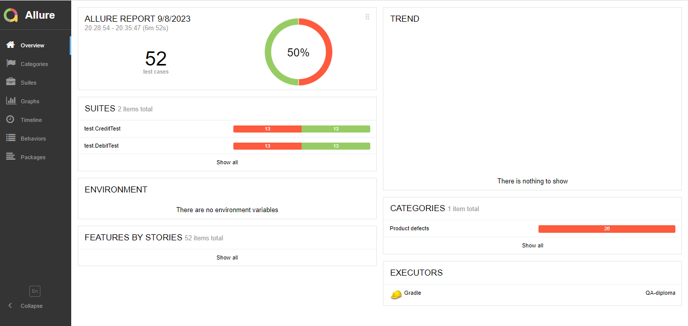
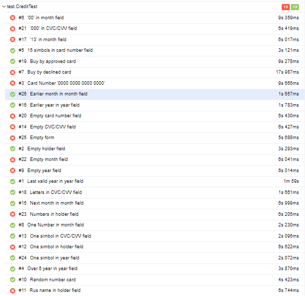
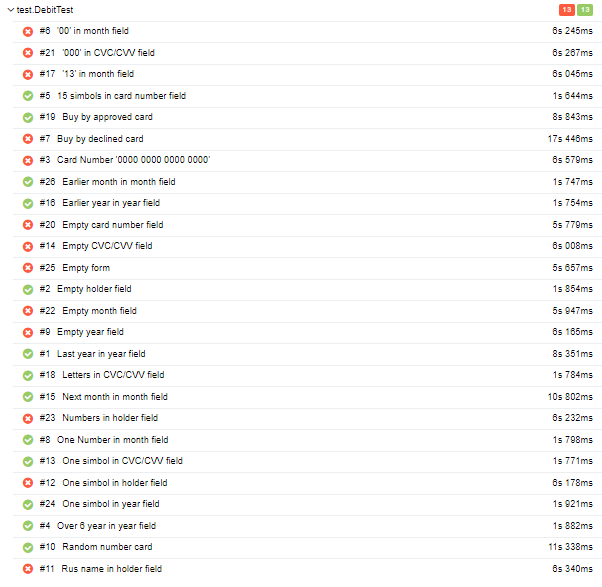

# Отчет о тестировании

В соответствии с тест-планом была проведена автоматизация тестирования приложения "Путешествие дня", которое предлагает купить тур картой или в кредит.

## Количество тест-кейсов 
 52 тест-кейса, из них:

* 26 тест-кейсов на проверку покупки тура картой:
    - 3 позитивных;
    - 23 негативных.
* 26 тест-кейсов на проверку покупки тура в кредит:
    - 3 позитиынх;
    - 23 негативных.

## Процент успешности тест-кейсов

Успешные тесты: 44,23%

Неуспешные тесты: 55,77%

## Общие рекомендации

Подробнее описать инструкции по настройке окружения.

Сделать более подробную техническую документацию приложения.

